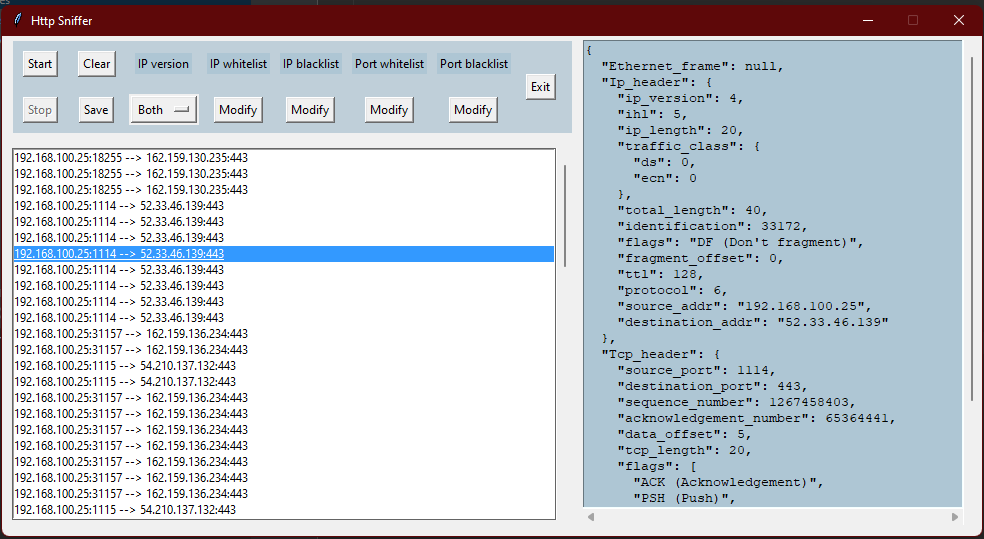
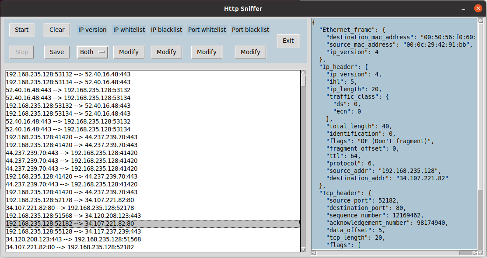

# GUI-HTTP-Sniffer
GUI HTTP Sniffer is a program that can sniff TCP packets.

## Features
These are the currently implemented features:
  * Interactive GUI
  * TCP packets sniffing
  * Ethernet frame parsing
  * IPV4 and IPV6 header parsing
  * TCP header parsing
  * HTTP parsing
  * Filtering packets according to ports and IPs whitelists/blacklists
  * Filtering packets on IPV4 and IPV6
  * Saving the captured packets
  * Previewing an unpacked and parsed packet

## Images
*Windows GUI*

*Linux GUI*